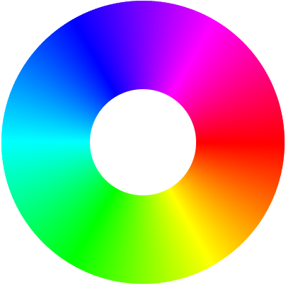

# Web LED

Simple application for set color led from web browser page. Sketch use p5.js.

## Partitions
add `storage` in custom partition file *`partitions.csv`*.
```
storage,  data, spiffs, , 1M,
```
## WEB server
files in path `/data`
```
/index.html
/sketch.js
/style.css
```
use `spiffs_create_partition_image(storage ../data FLASH_IN_PROJECT)` and with each burning, the files are assembled into an image and flashed

1. setup wifi login/pass.
1. build and flash.
1. connect to led.
1. open on browser `webled.local`.


